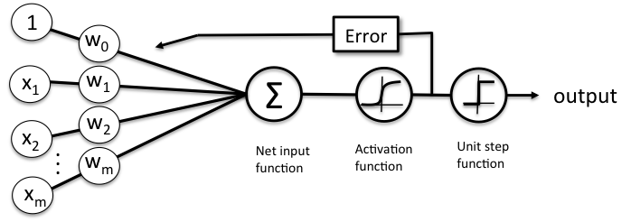
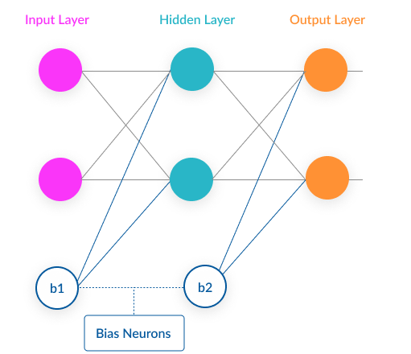

# Setup ambiente

## Rimuovo tutte le variabili dall'ambiente di lavoro
```{r}
rm(list = ls())
```


## Carico i dati che ho precedentemente pulito nel file di *Data_Cleaning*.
```{r}
HomeCredit_Dataset = readRDS(file = "ProcessedDataset.rds")
HomeCredit_Dataset_Fix_Skew = readRDS(file = "FixSkew.rds")
```


# Controllo i dati

## Controllo eventuali valori mancanti nel dataset

### Controllo numerico

```{r}
# Mostro a monitor il numero di valori mancanti in ogni colonna del dataset caricato
Number_Of_NAs = colSums(is.na(HomeCredit_Dataset)) 
print(Number_Of_NAs)
```

### Controllo grafico
```{r}
library(ggplot2)
library(naniar)
# Rappresentazione grafica delle colonne con valori mancanti
Na_Index_COlumns = (colSums(is.na(HomeCredit_Dataset)) != 0)
Dataset_NAs = HomeCredit_Dataset[,Na_Index_COlumns]
gg_miss_var(Dataset_NAs) + ylab("Numero di valori mancanti") +xlab("Variabili con valori mancanti")
```

## Rimozione/Imputazione dei valori mancanti

```{r}
# Dato che alcune variabili hanno un ridotto numero di NAs, posso rimoverli senza perdere molte osservazioni.

Number_Of_NAs = colSums(is.na(Dataset_NAs)) 
Number_Of_NAs<200 # Guardo per quali colonne il numero di valori mancanti è inferiore a 200

# Rimuovo valori mancanti da quelle colonne che ne hanno pochi.
HomeCredit_Dataset = HomeCredit_Dataset[!is.na(HomeCredit_Dataset$LoanAnnuity),] # Perdiamo 2 osservazioni.
HomeCredit_Dataset = HomeCredit_Dataset[!is.na(HomeCredit_Dataset$PriceOfItem),] # Perdiamo 38 osservazioni.

Number_Of_NAs = colSums(is.na(HomeCredit_Dataset)) 
Number_Of_NAs # Gli NAs sono stati rimossi dalle colonne desiderate e sono state perse solo 40 osservazioni.

# Facciamo lo stesso per il dataset usato successivamente per correggere la distorsione.
HomeCredit_Dataset_Fix_Skew = HomeCredit_Dataset_Fix_Skew[!is.na(HomeCredit_Dataset_Fix_Skew$LoanAnnuity),]
HomeCredit_Dataset_Fix_Skew = HomeCredit_Dataset_Fix_Skew[!is.na(HomeCredit_Dataset_Fix_Skew$PriceOfItem),]

```

## Analisi sui valori anomali della variabile "DaysOfCurrentJob".
La variabile "DaysOfCurrentJob" aveva dei valori anomali (con valore 365243). Questi valori anomali sono da me stati sostituiti con NAs nel processo di Data Cleaning.
La successiva analisi è stata fatta per vedere se in quei valori anomali sono rinchiuse informazioni utili per la predizione della TargetVariable o se questi errori sono uniformemente distribuiti.

```{r}
Indice_ANomalia = is.na(HomeCredit_Dataset$DaysOfCurrentJob) # Bool dei valori anomali
Dataset_Anomali = HomeCredit_Dataset[Indice_ANomalia,]       # Salvo in un nuovo datset solo i valori anomali.
Dataset_NONAnomali = HomeCredit_Dataset[!Indice_ANomalia,]   # Salvo in un nuovo datset solo i valori Non anomali.

# Cerco di capire se questo valore incide sul Target o se questo errore è omogeneamente distribuito su tutto il dataset. Per fare questo guardo se la percentuale di soggetti che hanno avuto problemi con la restituzione del debito (TargetVariable = 1) è la stessa nei due dataset appena creati:

MeanTarget_Anomali = mean(as.numeric(Dataset_Anomali$TargetVariable)-1)*100
MeanTarget_NONAnomali = mean(as.numeric(Dataset_NONAnomali$TargetVariable)-1)*100

cat("Percentuale clienti con difficoltà di pagamento (Dataset Anomali):     ",MeanTarget_Anomali,"% \n")
cat("Percentuale clienti con difficoltà di pagamento (Dataset Non Anomali): ",MeanTarget_NONAnomali,"% \n")


```
Sembra che ci sia una distinzione nella percentuale di soggetti che hanno avuto difficolta di pagamento tra i soggetti che presentano l'anomalia nella registrazione del dato su DaysOfCurrentJob e quelli che invece possiedono valori non anomali per questa feature. Quindi l'errore di registrazione non sembra essere casuale, ma sembra contenere al suo interno dell'informazione utile per la futura predizione della TargetVariable.

Per avere conferma che questa anomalia possa essere utile per prevedere la TargetVariable e che non sia solo rumore statistico effettuo un t-test.
```{r}
# Facciamo un t-test di differenza di medie per vedere se la differenza nelle percentuali di default tra osservazioni anomale e osservazioni coerenti è significativa.

HomeCredit_Dataset$TargetVariable_Num = as.numeric(HomeCredit_Dataset$TargetVariable) -1 # Converto la variabile target in numerica.

t.test(HomeCredit_Dataset$TargetVariable_Num[is.na(HomeCredit_Dataset$DaysOfCurrentJob) == TRUE],HomeCredit_Dataset$TargetVariable_Num[is.na(HomeCredit_Dataset$DaysOfCurrentJob) == FALSE], mu = 0, conf.level = 0.95, alternative = "two.sided")
```
Dato che il p-value ottenuto dal test di differenza di medie è di minore di 0,01 Possiamo rifiutare con elevata confidenza (99%) l’ipotesi nulla che i due valori siano uguali. Quindi questa differenza è statisticamente significativa. Il che significa che questo errore nella registrazione non è casuale, ma contiene al suo interno informazione che potrebbe essere utile per la predizione del valore della TargetVariable.

Per far si che i successivi modelli di machine learning considerino questa differenza tra le osservazioni in cui il valore era anomalo e quelle in cui non lo era aggiungo un ulteriore colonna in cui immagazzino una variabile binaria che segnala se l'osservazione aveva valore di "DaysOfCurrentJob" anomalo. Questa “Flag” appena creata avrà nome di DaysOfCurrentJob_Anomaly
```{r}
HomeCredit_Dataset$DaysOfCurrentJob_Anomaly = is.na(HomeCredit_Dataset$DaysOfCurrentJob)

HomeCredit_Dataset$DaysOfCurrentJob_Anomaly = factor(HomeCredit_Dataset$DaysOfCurrentJob_Anomaly)
```

## Imputazione dei valori mancanti
La maggioranza delle funzioni e algoritmi utilizzati qui di seguito funziona male in Dataset con valori mancanti (NAs). Per questa ragione, prima di utilizzare queste funzioni, bisogna rimuovere queste osservazioni o imputare dei valori a quelle colonne in cui ci sono valori mancanti.
La maggioranza delle variabili considerate conteneva un numero molto ridotto di valori mancanti, di conseguenza per gestire i valori mancanti in quelle variabili ho semplicemente rimosso alcune osservazioni.

In altre variabili invece il numero di osservazioni mancanti era troppo consistente per rimuoverle, in quanto una rimozione avrebbe portato a una troppo elevata riduzione del Dataset. Di conseguenza ho dovuto scegliere un metodo di imputazione.
Questa imputazione si sarebbe potuta fare in svariati modi. I valori mancanti possono essere sostituiti con la media dei valori di quella colonna, oppure possono essere sostituiti mediante una regressione usando le altre variabili, ecc. Il metodo che meno distorce il Dataset consiste nel sostituire i valori mancanti con dei valori stimati da una regressione multivariata che utilizza come variabile dipendente la variabile con valore da imputare e come regressori le altre variabili. Questo metodo assicura che i valori sostituiti siano coerenti con il resto dei valori disponibili per quella specifica osservazione. Tuttavia questo metodo risulta complesso e computazionalmente costoso. Dato che, come già evidenziato in precedenza, lo scopo di questa tesi non è la performance ottenuta del modello mi sono limitato a imputare come valore alle osservazioni con colonne mancanti la media della colonna in questione. Così facendo ho rimosso tutti i valori mancanti dal Dataset.

```{r}
Not_Na_Dataset = na.omit(HomeCredit_Dataset)
Index_Missing_Col = colSums(is.na(HomeCredit_Dataset)) != 0
Dataset_Missing    = HomeCredit_Dataset[,Index_Missing_Col]
Dateset_NonMissing = HomeCredit_Dataset[,!Index_Missing_Col]


for(i in 1:ncol(Dataset_Missing)){
  Dataset_Missing[is.na(Dataset_Missing[,i]), i] <- mean(Dataset_Missing[,i], na.rm = TRUE)
}

HomeCredit_Dataset = data.frame(Dataset_Missing,Dateset_NonMissing)


NACount = sum(colSums(is.na(HomeCredit_Dataset)) != 0)
cat("Totale numero NAs nel dataset: ",NACount, "\n")


# Faccio lo stesso per il dataset usato per il fix della distorsione del datset
Index_Missing_Col_fixDF = colSums(is.na(HomeCredit_Dataset_Fix_Skew)) != 0
Dataset_Missing_fixDF    = HomeCredit_Dataset_Fix_Skew[,Index_Missing_Col_fixDF]
Dateset_NonMissing_fixDF = HomeCredit_Dataset_Fix_Skew[,!Index_Missing_Col_fixDF]


for(i in 1:ncol(Dataset_Missing_fixDF)){
  Dataset_Missing_fixDF[is.na(Dataset_Missing_fixDF[,i]), i] <- mean(Dataset_Missing_fixDF[,i], na.rm = TRUE)
}

HomeCredit_Dataset_Fix_Skew = data.frame(Dataset_Missing_fixDF,Dateset_NonMissing_fixDF)
```
Così facendo ho rimosso tutti i valori mancanti dal dataset.

# Riduzione delle variabili esplicative considerate.

L’ultimo step di preparazione dei dati prima di poter passare alla fase di esplorazione è consistito nell’effettuare una ulteriore riduzione del numero di features considerate nell’analisi.
In particolare ho deciso di ridurre le features alle prime 10 per importanza (6 Quantitative e 4 qualitative). Ho fatto ciò ribadendo il fatto che quanto importa nella mia analisi non è l'accuracy, dato che questi diversi modelli sono portati solo a titolo di esempio.
Per selezionare le variabili quantitative da inserire nel modello ho calcolato la correlazione delle diverse variabili quantitative con la TargetVariable e mantenuto solo le 6 variabili più correlate con quest’ultima.
Qui di seguito si può vedere quali variabili sono risultate essere più correlate con la TargetVariable in valore assoluto. Le colonne in rosso sono relative a variabili con correlazione negativa con il target, le colonne in blu invece sono relative a variabili con correlazione positiva con il target.
Come si può notare qui la variabile più correlata con il  target è DaysOfCurrentJob, variabile che ha correlazione negativa con il Target (Colore Rosso), ovvero un suo aumento ha relazione negativa con la possibilità che il cliente abbia avuto problemi con il risarcimento del mutuo. Espanderemo più tardi su questa relazione quando andremo a interpretare i coefficienti stimati dal modello di Logistic Regression.

## Selezione delle variabili quantitative
```{r}
library(corrplot)
NumericColums =  unlist(lapply(HomeCredit_Dataset, is.numeric))
Dataset_Numeric    = HomeCredit_Dataset[,NumericColums]
Dataset_NonNumeric = HomeCredit_Dataset[,!NumericColums]


Corr_Matrix = cor(Dataset_Numeric)
corrplot(Corr_Matrix)
Index_Target = which(names(Dataset_Numeric)=="TargetVariable_Num")
Coll_TargetVariable = sort(abs(Corr_Matrix[-Index_Target,Index_Target]), decreasing = T) # Mantengo le correlazioni relative alla variabile "TargetVariable_Num".


MostCorrelated_Names = names(Coll_TargetVariable)[1:6]
MostCorrelated = Corr_Matrix[-Index_Target,Index_Target][1:6]
```

Alcune di queste variabili sono positivamente correlate con il Target, e altre negativamente correlate.
```{r}
MostCorrelated_Abs = sort(abs(MostCorrelated), decreasing = T)
barplot(MostCorrelated_Abs, col=ifelse(MostCorrelated>0,"blue","red"),las = 2,cex.names=.5,yaxt='n')
namesQuantitative_Best = names(MostCorrelated_Abs)

# ( E' importante specificare che questo approccio per la selezione delle variabili quantitative ha due problemi:
# Il primo problema è che stiamo osservando solo correlazione di forma lineare tra il Target e le variabili esplicative numeriche.
# Il secondo problema è che stiamo osservando la correlazione tra variabili numeriche e la conversione a numerico di un fattore, il che è comodo per calcolare le correlazioni ma non è il metodo più indicato per osservare la correlazione tra un fattore e delle variabili numeriche. Tuttavia per semplicità e per selezionare le variabili su cui lavorare è sufficiente. )
```


## Selezione delle variabili quantitative

Per selezionare le features qualitative ho dovuto seguire un approccio differente nella forma ma simile nella sostanza. Ho infatti utilizzato il chi-squared test di indipendenza tra variabili categoriche per calcolare quali variabili non erano indipendenti dalla TargetVariable e poi ho selezionato tra queste le 4 che avevano p-value inferiore, ovvero quelle 4 per cui l’indipendenza è stata rifiutata con maggiore confidenza.
Dato che l'ipotesi nulla del chi-squared test è che le due variabili categoriche siano indipendenti ho preso in considerazione solo quelle variabili in cui il p-value ottenuto è risultato inferiore allo 0.05, ovvero quelle in cui rifiutiamo l'ipotesi nulla di indipendenza con una confidenza uguale o maggiore del 95%.
```{r}
Target = Dataset_NonNumeric$TargetVariable # Salvo il target su un altro dataframe
Dataset_NonNumeric$TargetVariable = NULL   # Rimuovo il target

pvals_Qualitative = matrix(rep( 0, len= length(Dataset_NonNumeric)), nrow = length(Dataset_NonNumeric))


for(j in 1:length(Dataset_NonNumeric)){
  Feature = Dataset_NonNumeric[,j]
  chi_test = chisq.test(Target,Feature)
  p_val = chi_test$p.value
  pvals_Qualitative[j] = p_val
  }


pvals_Qualitative = data.frame(pvals_Qualitative)
rownames(pvals_Qualitative) = names(Dataset_NonNumeric)
```


```{r}
NonIndipendenti_Index = (pvals_Qualitative < 0.05)

NonIndipendenti = pvals_Qualitative[NonIndipendenti_Index,]

order = order(pvals_Qualitative$pvals_Qualitative)

names_df = rownames(pvals_Qualitative)[order]


pvals_Qualitative_Ordered = data.frame(pvals_Qualitative[order,])
rownames(pvals_Qualitative_Ordered) = names_df


namesQualitative_Best = rownames(pvals_Qualitative_Ordered)[1:4]

```

Qui sotto riporto una tabella contenente un valore indicativo della loro importanza derivato dal p-value del chi-test delle 4 variabili estratte.
```{r}
nomi1 = rownames(pvals_Qualitative_Ordered)[1:4]
pvals_Qualitative_Ordered2 = pvals_Qualitative_Ordered[nomi1,]
max1 = max(pvals_Qualitative_Ordered2)
pvals_Qualitative_Ordered2 = data.frame(max1*1.1 - pvals_Qualitative_Ordered2)
names(pvals_Qualitative_Ordered2) = "Importance"
pvals_Qualitative_Ordered2$Nomi = nomi1
pvals_Qualitative_Ordered2$Importance = pvals_Qualitative_Ordered2$Importance + 0.1
pvals_Qualitative_Ordered2 = pvals_Qualitative_Ordered2[order(pvals_Qualitative_Ordered2$Importance), ]  # sort
pvals_Qualitative_Ordered2

```


## Salvo solo le colonne alle quale sono interessato per l'analisi.
```{r}

names_Best10 = c(namesQualitative_Best,namesQuantitative_Best)
ColumnsToSave = c("TargetVariable",names_Best10)
HomeCredit_Dataset = HomeCredit_Dataset[,ColumnsToSave]

HomeCredit_Dataset_Fix_Skew = HomeCredit_Dataset_Fix_Skew[,ColumnsToSave]

```


# Esplorazione del Dataset

Prima di iniziare con lo sviluppo dei modelli per la predizione del Target è importante esplorare il Dataset per capire le diverse relazioni esistenti tra la variabile indipendente e le features usate per la predizione e anche tra le variabili indipendenti con esse stesse.


```{r}
# Creo la variabile TargetVariable_TF per semplificare la lettura dei futuri grafici
HomeCredit_Dataset$TargetVariable_TF = factor(HomeCredit_Dataset$TargetVariable, levels = c(0,1),labels = c("False","True"))
Not_Na_Dataset$TargetVariable_TF = factor(Not_Na_Dataset$TargetVariable, levels = c(0,1),labels = c("False","True"))
# Prendo il Not_Na_Dataset per fare l'esploraione dei dati dato che ho imputato molti missing values e questo potrebbe distorcere i risultati dell'esplorazione.
```


## Osservo la relazione tra la variabile dipendente e alcune variabili dipendenti.

### Relazione della Target Variable con DaysOfCurrentJob

La prima relazione che voglio esaminare è quella tra DaysOfCurrentJob e la TargetVariable.
Il primo passo fatto per analizzare la dipendenza tra queste due variabili consiste in due boxplot, uno della variabile DaysOfCurrentJob per i soggetti che hanno avuto un Default e un altro per la medesima variabile per i soggetti che non hanno avuto un Default.
```{r}
plot(
  Not_Na_Dataset$DaysOfCurrentJob ~ Not_Na_Dataset$TargetVariable_TF,
  ylab = "Giorni del lavoro corrente",
  xlab = "Il soggetto ha avuto problemi con la restituzione del prestito? ",
  frame.plot = FALSE,
  pch = 16,
  col = rgb(red = 110, green = 200, blue = 110, alpha = 80, maxColorValue = 255)
)

MediaGiorniCorrenteLavoroDatoTrue = mean(Not_Na_Dataset$DaysOfCurrentJob[Not_Na_Dataset$TargetVariable_TF == "True"])
MediaGiorniCorrenteLavoroDatoFalse = mean(Not_Na_Dataset$DaysOfCurrentJob[Not_Na_Dataset$TargetVariable_TF == "False"])

cat("Media Giorni del lavoro corrente dato TargetVariable = True:  ",MediaGiorniCorrenteLavoroDatoTrue, "\n")
cat("Media Giorni del lavoro corrente dato TargetVariable = False: ",MediaGiorniCorrenteLavoroDatoFalse,"\n \n")


```

E’ subito evidente dal grafico che la parte più consistente di soggetti che, al momento della sottoscrizione del mutuo, avevano il lavoro da un elevato numero di giorni sono nella distribuzione di sinistra, ovvero non hanno avuto problemi con la restituzione del debito.
Allo stesso modo si può vedere che la media (Barra nera) di DaysOfCurrentJob è più bassa per i soggetti che sono andati in Default sul prestito.
Si può anche notare che per quest’ultima categoria di soggetti la dispersione della variabile DaysOfCurrentJob attorno alla media è inferiore.
Tutti queste osservazioni ci indicano che una larga parte di soggetti che hanno avuto problemi con la restituzione del debito erano soggetti che al momento della sottoscrizione avevano il lavoro da poco tempo.

Facendo un t-test per osservare se la media della variabile DaysOfCurrentJob è diversa tra i soggetti che sono andati in Default sul debito e gli altri soggetti otteniamo i seguenti risultati:
```{r}
# T-test per osservare se la differenza nelle medie è significativa:

t.test(Not_Na_Dataset$DaysOfCurrentJob[Not_Na_Dataset$TargetVariable_TF == "True"],
       Not_Na_Dataset$DaysOfCurrentJob[Not_Na_Dataset$TargetVariable_TF == "False"],
       mu = 0, conf.level = 0.95, alternative = "two.sided")
```
Dato che il p-value del t-test è minore di 0.05, possiamo rifiutare con confidenza al 95% che la differenza tra la media di giorni del lavoro corrente per i soggetti che hanno avuto problemi con il pagamento e quelli che invece non hanno avuto tali problemi sia nulla.
Questo ci conferma che la variabile DaysOfCurrentJob è una variabile connessa con la variabile che vogliamo predire (TargetVariable) e di conseguenza ci indica che sarà utile inserire la variabile DaysOfCurrentJob nei modelli predittivi sviluppati in seguito.


Qui di seguito ho riportato lo stesso confronto visualizzato mediante un Violin-plot, il che rende più facile osservare come la variabile DaysOfCurrentJob influenza la TergetVariable.
```{r}
p <- ggplot(data= Not_Na_Dataset, aes(x=TargetVariable_TF, y=DaysOfCurrentJob, fill=TargetVariable_TF)) + geom_violin() + xlab("Il soggetto ha avuto problemi con la restituzione del prestito?") + ylab("Giorni del lavoro corrente")
p

```

Si può osservare come la maggior parte dei soggetti con un elevato valore in DaysOfCurrentJob sono nel violino relativo a TargetVariable = 0 (Ovvero sono soggetti che non hanno avuto problemi nella restituzione del debito). Si vede anche che la base del violino per TargetVariable = 1 è più larga, il che significa che la maggior parte dei soggetti che hanno avuto problemi con la restituzione del prestito erano soggetti che al momento della sottoscrizione del prestito avevano il lavoro da poco tempo, ovvero il loro valore di DaysOfCurrentJob è più vicino allo zero.

### Relazione della Target Variable con LoanAmmount

Nello studio della relazione tra TargetVariable e LoanAmmount il primo passo fatto è analogo a quello fatto al punto precedente, e anche i risultati sembrano essere i medesimi, dato che la media di LoanAmmount sembra essere superiore per quei soggetti che hanno avuto problemi con la restituzione del prestito.

```{r}
plot(
  Not_Na_Dataset$LoanAmmount ~ Not_Na_Dataset$TargetVariable_TF,
  ylab = "LoanAmmount",
  xlab = "Il soggetto ha avuto problemi con la restituzione del prestito? ",
  frame.plot = FALSE,
  pch = 16,
  col = rgb(red = 110, green = 200, blue = 110, alpha = 80, maxColorValue = 255)
)

DimensioneMedia_DatoTrue = mean(Not_Na_Dataset$LoanAmmount[Not_Na_Dataset$TargetVariable_TF == "True"])
DimensioneMedia_DatoFalse = mean(Not_Na_Dataset$LoanAmmount[Not_Na_Dataset$TargetVariable_TF == "False"])

cat("Media Income dato TargetVariable = True:  ",DimensioneMedia_DatoTrue, "\n")
cat("Media Income dato TargetVariable = False: ",DimensioneMedia_DatoFalse,"\n \n")


```

Tuttavia, il risultato del t-test per la differenza di medie smentisce questa ipotesi.
```{r}

# T-test per osservare se la differenza nelle medie è significativa:

t.test(Not_Na_Dataset$LoanAmmount[Not_Na_Dataset$TargetVariable_TF == "True"],
       Not_Na_Dataset$LoanAmmount[Not_Na_Dataset$TargetVariable_TF == "False"],
       mu = 0, conf.level = 0.95, alternative = "two.sided")

HomeCredit_Dataset$TargetVariable_TF = NULL # Rimuovo TargetVariable_TF da HomeCredit_Dataset
```

Infatti la differenza nelle medie di LoanAmmount per i due diversi gruppi di soggetti considerati è data semplicemente da rumore statistico e non è significativa.
A primo impatto risulta curioso notare come l'ammontare del prestito concesso al cliente non risulti avere un impatto significativo sull'esito del mutuo.
Tuttavia continuando l'analisi e tenendo in considerazione anche la relazione tra LoanAmmount e Income si può intuire perché quella variabile non abbia impatto significativo.

Qui sotto riporto il grafico relativo alla regressione lineare tra la variabile LoanAmmount e la variabile Income.
Il coefficiente di Income come regressore di LoanAmmount è di 0.93 ed è significativo al 99.9%.

```{r}

plot(
  Not_Na_Dataset$LoanAmmount ~ Not_Na_Dataset$Income,
  ylab = "Loan Amomount",
  xlab = "Income",
  main = "Regressione Lineare tra Reddito e Ammontare del prestito ottenuto",
  frame.plot = FALSE,
  pch = 16,
  col = rgb(red = 90, green = 110, blue = 240, alpha = 80, maxColorValue = 255))

Income_LoanAmmount_Linear = lm(Not_Na_Dataset$LoanAmmount ~ Not_Na_Dataset$Income)
abline(Income_LoanAmmount_Linear,col = "red",lwd = 2)

```
```{r}
library(texreg)
screenreg(Income_LoanAmmount_Linear)
```

Si può notare dal grafico e poi verificare dai dettagli della regressione lineare fatta tra Income e LoanAmmount, che c'è una forte tendenza lineare tra le due variabili e che questa tendenza è positiva e significativa. Ciò significa che reddito e ammontare richiesto nel mutuo tendono a muoversi nella stessa direzione e con simile intensità.
Questo potrebbe essere uno dei motivi per cui la variabile LoanAmmount non sembra avere impatto decisivo sulla probabilità di default dell’individuo.
Ovvero, da un lato il prestito è superiore e di conseguenza più difficile da ripagare, ma dall'altro c'è un maggior reddito a supporto di questo debito superiore.


### Relazione della Target Variable con AgeOfCar

Per l’analisi di questa relazione ho deciso di visulizzare le funzioni di densità della variabile AgeOfCar per i soggetti che hanno avuto problemi con la restituzione del debito e per i soggetti che invece non li hanno avuti.

```{r}
Temp1 = Not_Na_Dataset[Not_Na_Dataset$TargetVariable == 1,] 
Temp2 = Not_Na_Dataset[Not_Na_Dataset$TargetVariable == 0,]
Target_ = rbind(Temp1, Temp2)


library(dplyr)
Target_ = mutate(Target_, TargetVariable = factor(TargetVariable, level = c(0,1) ,label = c("False","True")))
# Make the density plot to show the distribution of the Taxi total fares within two areas.
ggplot(Target_, aes(AgeOfCar, fill = TargetVariable )) + geom_density(col = NA,alpha = 0.35) + xlim(0,50) + xlab("Età dell'auto posseduta") + ylab("Densità")
```

Come si può osservare da questo grafico la distribuzione dell’età dell'auto del cliente è diversa in base al fatto che il soggetto abbia avuto o meno problemi con la restituzione del prestito. Infatti una parte molto più consistente di soggetti che hanno avuto problemi con la restituzione del credito aveva, al momento della sottoscrizione del debito, un’auto più vecchia.
Questo significa che la feature AgeofCar potrà essere utile per la predizione della TargetVariable.

### Relazione tra il rapporto LoanAmmount/Income con la target variable e il genere del cliente.

Dato che, come visto in precedenza, l’ammontare di prestito sottoscritto e il reddito del soggetto sono molto correlati, ho deciso in questa successiva analisi di considerare il rapporto LoanAmmount/Income per andare a evidenziare i prestiti più o meno “a leva” rispetto al reddito del soggetto. Inoltre in questo confronto ho voluto considerare anche il sesso dei clienti per vedere se quest’ultimo aveva un qualche impatto sulle altre variabili considerate.

```{r}

Not_Na_Dataset$Temp = Not_Na_Dataset$LoanAmmount/Not_Na_Dataset$Income # Creo la variabile che contiene il rapporto LoanAmmount/Income

ggplot(Not_Na_Dataset, aes(Gender, Temp)) + 
  geom_violin(aes(fill=TargetVariable), alpha=0.9) +
  facet_wrap(~TargetVariable) + 
  scale_fill_brewer(palette = "Dark2", direction = -1) +
  ggtitle("LoanAmmount/Income ratio for different genders") +
  xlab("Genere") +
  ylab("Rapporto LoanAmmount/Income") +
  theme_bw() +
  theme(plot.title = element_text(hjust = 0.5))

Not_Na_Dataset$Temp = NULL # Rimuovo la variabile del rapporto dal dataset
```

Come si può notare dal grafico qui sopra, sia per gli uomini che per le donne che hanno avuto problemi con la restituzione del prestito, il rapporto LoanAmmount/Income risulta essere più elevato rispetto a quello dei soggetti che non hanno avuto problemi di restituzione del prestito. (Le basi dei violini color verde acqua sono più alte rispetto a quelle dei violini marroni).
Inoltre si può anche notare che le distribuzioni per soggetti di sesso maschile e soggetti di sesso femminile differiscono tra di loro, soprattutto nel caso in cui i soggetti abbiano avuto problemi con la restituzione del prestito. Questo suggerisce che anche l'inserimento della variabile gender all'interno dei successivi modelli potrebbe aiutare nella predizione.


### Relazione tra TargetVariable e OccupationType.

Qui di seguito analizzo come le diverse professioni svolte dai clienti influenzano la loro capacità di ripagare o meno il prestito ricevuto.
Faccio ciò calcolando la percentuale di prestiti non pagati per ogni diversa classe di lavoratori e poi normalizzando queste percentuali per ottenere il grafico seguente:

```{r}
OccupationType_Names = levels(HomeCredit_Dataset$OccupationType) # Salvo i nomi delle professioni presenti nel dataset in una nuova colonna

N_Names = length(OccupationType_Names) # Numero di professioni

Percentage_CreditProblems=  rep(0, len= N_Names) # Inizializzo il vettore dove salverò le percentuali di default per le diverse categorie di lavoratori

# Calcolo della percentuale di problemi creditizi per ogni categoria di lavoratori del dataset
for(j in 1:N_Names){
Name = OccupationType_Names[j]
Sum_Target_Name = sum(as.numeric(HomeCredit_Dataset$TargetVariable[HomeCredit_Dataset$OccupationType == Name])-1)
N_Obs_Name = sum(HomeCredit_Dataset$OccupationType == Name)
Percentage_CreditProblems[j] = Sum_Target_Name/N_Obs_Name
  }


Percentage_CreditProblems_Normalized = round((Percentage_CreditProblems - mean(Percentage_CreditProblems))/sd(Percentage_CreditProblems), 2)  # Normalizzo la Percentage_CreditProblems

Percentage_CreditProblems_InfSup_Flag = ifelse(Percentage_CreditProblems_Normalized < 0, "Inf", "Sup")  # Flag che indica quando la percentuale è sopra/ sotto la media

DataSet_Percentuali = data.frame(OccupationType_Names,Percentage_CreditProblems_Normalized,Percentage_CreditProblems_InfSup_Flag,Percentage_CreditProblems)
names(DataSet_Percentuali) = c("Nome_Professione","Perc_Norm","Flag","Perc_NonNorm")

DataSet_Percentuali = DataSet_Percentuali[order(DataSet_Percentuali$Perc_Norm), ]  # Sort

DataSet_Percentuali$Nome_Professione <- factor(DataSet_Percentuali$Nome_Professione, levels = DataSet_Percentuali$Nome_Professione)  

# Diverging Barcharts
ggplot(DataSet_Percentuali, aes(x=Nome_Professione, y=Perc_Norm, label=Perc_Norm)) + 
  geom_bar(stat='identity', aes(fill=Flag), width=.5)  +
  scale_fill_manual(name="TargetVariable", 
                    labels = c( "Sotto la media","Sopra la Media"), 
                    values = c("Inf"="#00ba38", "Sup"="#f8766d")) + 
  labs(subtitle="Percentuale Normalizzata di problemi creditizi", 
       title= "Barre divergenti") + ylab("Percentuale problemi creditizi - Normalizzata") + xlab("Tipo di professione") + 
  coord_flip()

```

Come si può osservare da questo grafico, le professioni che hanno avuto più problemi creditizi con la restituzione dei prestiti sono Realty Agents, Secretaries e Security Staff, dato che queste classi hanno le maggiori percentuali normalizzate di Defaults. Dall'altro lato possiamo osservare che i lavoratori che hanno avuto meno problemi con la restituzione del debito sono HR staff, IT staff e High skill tech staff.
Il fatto che i diversi livelli di questa variabile abbiano percentuali diverse di problemi creditizi indica che questa variabile sarà utile per aiutare nella predizione della variabile target.
Ad esempio, a parità di altri fattori, se avessimo due soggetti di cui uno è un Realty Agent e l'altro è fa l’HR Staff e dovessimo predire quale dei due soggetti potrebbe avere problemi nella restituzione del debito il nostro best guess sarebbe sul Realty Agent, in quanto i soggetti appartenenti a quella categoria hanno tendenza ad avere una maggiore percentuale di problemi creditizi.


Il grafico qui sotto invece riporta i valori non normalizzati delle percentuali di problemi creditizi per i diversi livelli di OccupationType.
```{r}

ggplot(DataSet_Percentuali, aes(x=Nome_Professione, y=Perc_NonNorm)) + 
  geom_point(size=3) + 
  geom_segment(aes(x=Nome_Professione, 
                   xend=Nome_Professione, 
                   y=0, 
                   yend=Perc_NonNorm)) + 
  labs(title="Lollipop chart ordinata", 
       subtitle="Percentuali di problemi creditizi per OccupationType") + 
  theme(axis.text.x = element_text(angle=75, vjust=0.6)) + xlab("Tipo di Professione") + ylab("Percentuale di problemi creditizi")

```


### Relazione tra HighestEducation e il rapporto LoanAmmount/Income

Per svolgere l’analisi del rapporto tra TargetVariable e HigherEducation sono partito dall’analisi di come il grado di educazione influisse sulla distribuzione del rateo LoanAmmount/Income in quanto, come visto in precedenza, questo rapporto è positivamente correlato con la probabilità di default.

```{r}
# Plot

Not_Na_Dataset$temp = Not_Na_Dataset$LoanAmmount/Not_Na_Dataset$Income
g <- ggplot(Not_Na_Dataset, aes(temp))
g + geom_density(aes(fill=factor(HighestEducation)), alpha=0.8) + 
    labs(title="Density plot", 
         subtitle="Distribuzione del rapporto LoanAmmount/Income per diversi livelli di HighestEducation",
         x="LoanAmmount/Income",
         fill="# Highest Education") + xlim(0,15) +xlab("Rapporto LoanAmmount/Income") + ylab("Densità")

Not_Na_Dataset$temp = NULL


```

Qui sopra si può vedere la distribuzione della variabile LoanAmmount/Income in base al livello di educazione più alto conseguito dai clienti.
Si nota come le distribuzioni tendono a essere più spostate verso destra per livelli più bassi di HighestEducation. Questo ci indica che i soggetti come un livello più basso di educazione tendono a richiedere mutui sproporzionati rispetto al loro reddito, portando così ad un rapporto LoanAmmount/Income più alto.
In particolare si può notare che i soggetti con livello di educazione più basso presente nel Dataset (Lower secondary) hanno una distribuzione decisamente anomala rispetto a quelle relative ai restanti livelli di HighestEducation. Questi clienti infatti chiedono in media prestiti di gran lunga più elevati rispetto al loro stipendio rispetto alle altre categorie di soggetti.

Come già detto in precedenza c’è la tendenza del rapporto LoanAmmount/Income di muoversi all’unisono con la probabilità di default, e questo trova conferma anche nel grafico qui sotto, che contiene le percentuali di Default per i diversi livelli di HighestEducation.

```{r}

HighestEducation_Names = levels(Not_Na_Dataset$HighestEducation)[2:5] # Salvo i nomi delle professioni presenti nel dataset in una nuova colonna

N_Names = length(HighestEducation_Names) # Numero di professioni

Percentage_CreditProblems=  rep(0, len= N_Names) # Inizializzo il vettore dove salverò le percentuali di default per le diverse categorie di lavoratori

# Calcolo della percentuale di problemi creditizi per ogni categoria di lavoratori del dataset
for(j in 1:N_Names){
Name = HighestEducation_Names[j]
Sum_Target_Name = sum(as.numeric(Not_Na_Dataset$TargetVariable[Not_Na_Dataset$HighestEducation == Name])-1)
N_Obs_Name = sum(Not_Na_Dataset$HighestEducation == Name)
Percentage_CreditProblems[j] = Sum_Target_Name/N_Obs_Name
  }


Percentage_CreditProblems_Normalized = round((Percentage_CreditProblems - mean(Percentage_CreditProblems))/sd(Percentage_CreditProblems), 2)  # Normalizzo la Percentage_CreditProblems


Percentage_CreditProblems_InfSup_Flag = ifelse(Percentage_CreditProblems_Normalized < 0, "Inf", "Sup")  # Flag che indica quando la percentuale è sopra/ sotto la media

DataSet_Percentuali = data.frame(HighestEducation_Names,Percentage_CreditProblems_Normalized,Percentage_CreditProblems_InfSup_Flag,Percentage_CreditProblems)
names(DataSet_Percentuali) = c("HighestEduc","Perc_Norm","Flag","Perc_NonNorm")

DataSet_Percentuali = DataSet_Percentuali[order(DataSet_Percentuali$Perc_Norm,decreasing = T), ]  # Sort

DataSet_Percentuali$HighestEduc <- factor(DataSet_Percentuali$HighestEduc, levels = DataSet_Percentuali$HighestEduc)  


ggplot(DataSet_Percentuali, aes(x=HighestEduc, y=Perc_NonNorm)) + 
  geom_bar(stat="identity", width=.5, fill="tomato3") + 
  labs(title="Grafico a barre ordinate", 
       subtitle="Percentuale problemi creditizi per HighestEducation") + 
  theme(axis.text.x = element_text(angle=65, vjust=0.6)) +xlab("Livello di Educazione") + ylab("Percentuale di problemi creditizi")


```


```{r}
# Aggiunta di dati per bilanciare il dataset.
# In questo specifico esempio il dataset è sbilanciato, ovvero ci sono molto più osservazioni di una specifica classe che nell'altra. Questo crea problemi a molti algoritmi di ottimizzazione, soprattutto poichè il numero di osservazioni con cui sto lavorando è ridotto. Per soluzionare il problema, utilizzerò dati estratti dal dateset completo selezionando solo osservazioni della classe minoritaria (Nel nostro caso quella con TargetVariable == 1) per bilanciare il dataset.


Percentage0 =(sum(HomeCredit_Dataset$TargetVariable == 0)/(dim(HomeCredit_Dataset)[1]))*100
cat("La percentuale di osservazioni in cui il target ha valore = 0 è il",Percentage0, "%")
```


```{r}
# Aggiungiamo questi dati appena importati al dataset di allenamento.
SyntheticData = HomeCredit_Dataset_Fix_Skew[1:3378,]
```


```{r}
HomeCredit_Dataset =rbind(HomeCredit_Dataset,SyntheticData)

Percentage0 =(sum(HomeCredit_Dataset$TargetVariable == 0)/(dim(HomeCredit_Dataset)[1]))*100
cat("La percentuale di osservazioni in cui il target ha valore = 0 è il",Percentage0, "%")

# Ora il dataset è bilanciato.

```


## Divisione del dataset in Train set e Test set
Ora che ho completato le modifiche al Dataset da utilizzare per la creazione dei modelli lo divido in un congiunto di allenamento e un congiunto di test.
Questo processo è essenziale per assicurare che il modello sia in grado di performare in dati mai visti prima. I modelli verranno allenati sul dataset di Allenamento. ma la performance degli stessi varrà poi misurata utilizzandoli per prevedere la TargetVariable sul dataset di test.
Se non si facesse questo processo si potrebbe ottenere un modello che ha un ottima performance quando testato, ma che, una volta testato su dati *out of sample* risulta avere una pessima performance. (Spesso a causa di problemi di Overfitting).

```{r}
library(caTools)
set.seed(1) # Impostare un seed per la riproducibilità dei risultati
sample = sample.split(HomeCredit_Dataset$TargetVariable,SplitRatio = 0.80) 

HomeCredit_Dataset_Train = subset(HomeCredit_Dataset,sample ==TRUE)
HomeCredit_Dataset_Test  = subset(HomeCredit_Dataset, sample==FALSE)

# Reset degli indici
rownames(HomeCredit_Dataset_Train) <- NULL
rownames(HomeCredit_Dataset_Test) <- NULL
```
In questo modo mantengo l'80% delle osservazioni come dati su cui allenare i modelli, e riservo il 20% delle stesse per verificare l'effettiva performance *out of sample* dei diversi modelli.


# Creazione dei modelli

## Logistic Regression

Il primo modello considerato è il modello di regressione logistica, questo modello, tra quelli considerati, è il più facile da implementare, analizzare e interpretare.
Il modello di Logistic regression è considerato un modello lineare, in quanto l'outcome dipende sempre e solo dalla somma degli input e dei parametri.




Qui sopra si può vedere la struttura che assumono questi tipi di modelli.
Gli input forniti, qui rappresentati dalle variabili x_1…x_m, sono moltiplicati ognuno per un peso w_1…w_m e successivamente vengono sommati tra di loro, nella somma è incluso anche w_0 in quanto risultato del prodotto w_0*1, questo è il termine di Biasi, ovvero il termine additivo dell’equazione.
Questi parametri w_0…w_m sono i parametri appresi dall’algoritmo mediante il processo di apprendimento dai dati.
Una volta terminata l’aggregazione il risultato di questa somma viene passato a una funzione di attivazione, che nel caso della regressione logistica è la funzione logistica, definita come 1/((1+e^(-x))), funzione che comprime ogni valore in un valore tra 0 e 1. Lo step finale per effettuare la predizione consiste nel verificare se il valore ottenuto risulta essere superiore o inferiore della threshold decisa. 

### Selezione delle variabili da inserire nel modello

Il primo passo per implementare questo modello consiste nel selezionare quali variabili inserire nello stesso. Questo processo è essenziale dato che inserire un numero troppo elevato di variabili potrebbe portare a overfitting e dall’altro lato l’inserimento di un numero troppo ridotto di variabili potrebbe portare a underfitting.

Un metodo intuitivo per selezionare le variabili da inserire nel modello consiste nell'utilizzo del metodo StepAIC. Questo metodo inserisce o rimuove le variabili in modo che il modello risultante sia il modello con AIC (Akaike Information Criterion) minore, dove l'AIC è uno stimatore della qualità di un modello statistico per un determinato Dataset. 
L' AIC tiene conto non solo della performance del modello, ma anche del numero di parametri utilizzati nello stesso, questo aspetto è essenziale per ridurre la probabilità di Overfitting. 

```{r}
# Utilizzo dello StepAIC per selezionare le variabili da inserire nella regressione logistica
set.seed(1)
ModelloPieno = glm(TargetVariable ~ .,family=binomial, data = HomeCredit_Dataset_Train)
summary(ModelloPieno)

ModelloVuoto <- glm(TargetVariable ~ 1,family=binomial,data = HomeCredit_Dataset_Train)
summary(ModelloVuoto)


backwards = step(ModelloPieno)
```

Il risultato di questo processo di ottimizzazione è che Il modello con AIC più basso, ovvero quello migliore secondo questo criterio, è quello che come regressori usa le seguenti variabili:
*IncomeType*
*Gender*
*HighestEducation*
*DaysOfCurrentJob*
*Income*
*Building_AptSize_Avg*
*AgeOfCar*

Di conseguenza utilizzeremo queste variabili nella definizione del modello e alleneremo il modello specificato sul Train Set.


```{r}
library(caret)
train.control = trainControl(method = "repeatedcv", number = 4, repeats=1) # Parametro trControl per la funzione caret::train.
# Questo parametro specifica alla funzione train della libreria caret di utilizzare il metodo cross-validation con k folds, io in questo caso ho specificato k = 4 e ho specificato anche di fare 1 singola ripetizione. Questo è per motivi di efficienza computazionale, nella pratica per la selezione del modello è buona prassi usare k-folds cross-validation con circa 10 folds e almeno 3 ripetizioni.
```


```{r}
# Allenamento del modello
LogisticRegression_Classifier = train(TargetVariable ~ 
                                        Income +
                                        Building_AptSize_Avg + 
                                        Gender + 
                                        HighestEducation +
                                        AgeOfCar +
                                        IncomeType +
                                        DaysOfCurrentJob,
                                        data = HomeCredit_Dataset_Train, method="glm",
                                        family="binomial",trControl=train.control)


```

```{r}
# Predizione dei valori sul dataset di Test usando il modello appena allenato
Prediction_LogisticRegression = predict(LogisticRegression_Classifier, newdata = HomeCredit_Dataset_Test)
```


```{r}
# Print della confusion matrix e dell'accuracy del modello
ConfusionMatrix_LogisticRegression = data.frame(table(HomeCredit_Dataset_Test$TargetVariable, Prediction_LogisticRegression))
names(ConfusionMatrix_LogisticRegression)[1] = "Real Value"

TruePositive  = ConfusionMatrix_LogisticRegression[4,3]
TrueNegative = ConfusionMatrix_LogisticRegression[1,3]


Accuracy_LogisticRegression = (TruePositive + TrueNegative)/(dim(HomeCredit_Dataset_Test)[1])

cat(" Precisione del modello logistic Regression:",Accuracy_LogisticRegression*100,"%")

```

Da questa matrice si può ricavare l’accuracy  del modello, ovvero 61,8%.
Questo dato ci indica che il modello ottenuto effettua correttamente la classificazione circa il 62% delle volte.

Un dettaglio importante del modello di regressione logistica è che per la costruzione di questo modello ho dovuto selezionare "manualmente" le variabili da inserire. Questo non sarà più necessario in alcuni dei modelli successivi, modelli in cui l'algoritmo utilizzato è in grado di fare una selezione automatica delle variabili più influenti nella predizione del Target.


### Interpretazione del modello

Per quanto riguarda l’interpretazione del modello è necessario guardare i coefficienti stimati.
Ho riportato i coefficienti stimati nella seguente tabella:

```{r}
Coefficients_LogReg = LogisticRegression_Classifier$finalModel$coefficients

Coefficients_LogReg


```

Anche se questa tabella ha 18 file, le stime originano da un modello che contiene solo 7 variabili predittive.
Ci sono svariate ragioni per cui il numero di variabili indipendenti è differente dal numero di coefficienti stimati. 
La stima dell'intercetta è sempre presente e non è relazionata al numero di features considerate.
La seconda ragione sta nel fatto che alcune di queste features sono categoriche e per essere utilizzate nella regressione devono essere espanse . 
Come si può notare in questo esempio, le variabili IncomeType e HighestEducation sono state espanse e i loro livelli sono stati trasformati in singole variabili binarie. 

Per capire il significato di questa trasformazione è secondo me utile concentrarsi su un esempio: La variabile IncomeTypePensioner è una variabile che vale 1 se il tipo di reddito del soggetto in questione deriva dalla pensione e 0 in tutti gli altri casi. 

Questa variabile ha un coefficiente di -0.659. Questo coefficiente è negativo, il che vuol dire che, a parità di altri fattori i soggetti che ricevono il reddito dalla pensione avranno meno probabilità di riscontrare problemi nella restituzione del debito, ovvero sarò più probabile che la TargetVariable assuma valore pari a 0.
Quindi, dato che la variabile in questione è una variabile binaria l’interpretazione può essere riassunta mediante la seguente frase: "I soggetti che ricevono il proprio reddito da pensione saranno meno propensi ad avere problemi creditizi rispetto a soggetti che ricevono il proprio reddito da altre fonti".


Per capire la magnitudine dell'effetto di queste variabili sulla predizione finale bisogna guardare i valori assoluti dei coefficienti.
Invece per l’interpretazione delle variabili categoriche è utile soffermarsi sulle differenze tra le diverse categorie, ad esempio si può dire che l'effetto di essere disoccupato, ovvero che la variabile IncomeTypeUnemployed sia uguale a 1, variabile che ha coefficiente della regressione pari a 12.43, è leggermente inferiore dell'effetto di avere come più alto livello di educazione la Lower Secondary, variabile che ha un coefficiente di 12,89.

Nel caso invece di variabili numeriche il discorso è un po' più complesso, in quanto ciò che incide non è solo il coefficiente, ma anche il range di valori che la variabile assume. Ad esempio, il coefficiente della variabile numerica Income è di -0.00000122244 valore che a primo impatto risulta essere minuscolo, tuttavia il suo effetto sulla TargetVariable non è poi così debole se si considera che i valori assunti da questa feature spaziano da 25650 fino a 2250000. Questo range significa che, nel caso estremo, questo valore assumerebbe una magnitudine di
-0.00000122244*(2.250.000 - 25.650) = -2.719134
 Il che è circa 4 volte l'impatto che si ha dal fatto di ricevere il proprio reddito da pensione.

Nei casi in cui il valore del coefficiente è NA, significa che il valore non è statisticamente significativo con confidenza al 95% e di conseguenza deve essere trattato come uno 0. Per esempio, l'impatto di ricevere il proprio reddito da Maternity Leave non ha alcun impatto sulla variabile dipendente, dato che IncomeTypeMaternity leave = 0.

Come detto in precedenza, la formula della trasformazione logistica  è la seguente: 1/((1+e^(-x))). Dove in x dobbiamo inserire la somma di tutti i coefficienti moltiplicati per i valori delle variabili relativi all'osservazione per cui stiamo cercando di effettuare la predizione e a cui dobbiamo poi aggiungere l'intercetta (w_0*1 ).
Ad esempio:
Supponiamo di voler predire la probabilità di default per un soggetto che è Uomo, ha reddito di 100.000, la cui auto ha 15 anni, che riceve il reddito da Maternity Leave e il cui livello di educazione più elevato è Lower Secondary.
in questo specifico caso

x = 
-12.3607 (Intercetta)
+ 0.2597 (Uomo)
-0.00000122244 (Reddito)* 100.000
 + 0.02386317(AgeOfCar)  * 15
+ 0 (Maternity Leave) 
+ 12.88945(Lower Secondary)
= 1.02415
Probabilità Stimata =   1/(1+e^(-1.02415) )  = 0.7358.
Il soggetto in questione avrà una probabilità stimata del 73,58% di avere problemi nella restituzione del prestito.


## Naive Bayes

Naive Bayes è un algoritmo probabilistico che utilizza la teoria della probabilità e in particolare il teorema di Bayes per predire il Target.
Il fatto che sia un algoritmo probabilistico deriva dal fatto che, per effettuare la predizione di interesse, calcola la probabilità di ogni possibile categoria di classificazione (Ovvero, in questo caso, la probabilità che TargetVariable sia uguale a 1) e sceglie come predizione la categoria con probabilità più elevata.


```{r}
library(e1071)

# Training del modello Naive Bayes
NaiveBayes_classifier = naiveBayes(TargetVariable ~ ., data = HomeCredit_Dataset_Train, laplace = 1)
# L'aggiunta del parametro di Laplace aggiunge 1 a ogni classe. Questo aiuta in quanto evita di escludere un intera classe a causa di una sola variabile. (In sostanza evita che ci siano 0 nelle tabelle di interazione tra classi e livella della variabile target mantenendo le proporzioni uguali)

# Test del modello sul Test set
Prediction_NB = predict(NaiveBayes_classifier, newdata = HomeCredit_Dataset_Test, type = "raw")
```

```{r}
# Calcolo dell'accuracy e print della confusion matrix
seed = 5
NaiveBayes_Prediction = predict(NaiveBayes_classifier, newdata = HomeCredit_Dataset_Test)


ConfusionMatrix_NaiveBayes = data.frame(table(HomeCredit_Dataset_Test$TargetVariable, NaiveBayes_Prediction))
names(ConfusionMatrix_NaiveBayes)[1] = "Real Value"


TruePositive  = ConfusionMatrix_NaiveBayes[4,3]
TrueNegative = ConfusionMatrix_NaiveBayes[1,3]


Accuracy_NaiveBayes = (TruePositive + TrueNegative)/(dim(HomeCredit_Dataset_Test)[1])

```

### Esempio valori predetti e calcolo dell'accuracy
```{r}
set.seed(seed)
Random_Test = sample(1:dim(HomeCredit_Dataset_Test)[1], 5)

Predicted_NB = data.frame(Prediction_NB[Random_Test,2])
names(Predicted_NB) = "Prob(Target = 1)"
Predicted_NB$PredictedVal = NaiveBayes_Prediction[Random_Test]
Predicted_NB$Actual_TargetVar = HomeCredit_Dataset_Test$TargetVariable[Random_Test]


Predicted_NB
```


Qui sopra si possono vedere le predizioni per 5 osservazioni del Dataset estratte casualmente con le relative probabilità stimate di fianco.
In generale, più alto è il valore della probabilità della classe con massima probabilità e più affidabile sarà quella specifica predizione.


```{r}
cat(" Precisione del modello Naive Bayes:",Accuracy_NaiveBayes*100,"%")

```
L’accuracy di questo modello sul Test Set è del 61.32% il che lo rende molto simile in performance al modello di Logistic Regression. Allo stesso modo anche il grado di interpretabilità di questo modello è estremamente alto, in quanto un’analisi delle probabilità condizionali calcolate per lo sviluppo del modello ci può dire come è stata fatta la predizione.

### Interpretazione del modello

Le probabilità stimate derivano dall'applicazione del teorema di Bayes, teorema basato sulle probabilità condizionate.
La probabilità condizionata è la probabilità che accada qualcosa, dato il fatto che qualcos'altro è già accaduto. Usando la probabilità condizionale, possiamo stimare la probabilità di un evento basandoci solo su conoscenza pregressa.
La formula della probabilità condizionata è la seguente:
P(E│C)=(P(C│E)*P(E))/(P(C))  
Dove:
P(E)       E' la probabilità che l'evento accada.
P(C)       E' la probabilità che la condizione accada.
P(C|E)   E' la probabilità della condizione dato che l'evento è accaduto.
P(E|C)   E' la probabilità che l'evento accada dato che la condizione è accaduta.

Come già accennato l'algoritmo Naive Bayes si basa su questo teorema per predire le probabilità che una certa osservazione appartenga a una certa classe.
Questo algoritmo si basa sull'assunzione che ogni feature sia indipendente dalle altre.


Qui di seguito riporto una tabella per le probabilità condizionate relativa al fattore "IncomeType"
```{r}
NaiveBayes_classifier$tables$IncomeType
ProbCond = as.data.frame(NaiveBayes_classifier$tables$IncomeType)
ProbCond
```
Questi valori rappresentano le probabilità che un soggetto appartenga ad una specifica classe di reddito condizionata al fatto che la TargetVariable sia Vera o Falsa.
I livelli della classe IncomeType più di interesse sono quelli che hanno valori diversi delle probabilità che il soggetto riceva reddito da quella specifica classe condizionato al fatto che il soggetto abbia avuto problemi di credito o meno. Questo è dato dal fatto che, maggiore sarà questa differenza (In termini relativi) e maggiore sarà la capacità di predire il valore della TargetVariable basandoci su quello specifico livello.
Ad esempio, si può notare che per il livello "Maternity Leave" le due probabilità sono uguali, il che significa che la probabilità che un cliente riceva il suo reddito da Maternity Leave è la stessa indipendentemente dal fatto che questo cliente abbia TargetVariable = 1 o TargetVariable = 0 (Ovvero abbia avuto o meno problemi nella restituzione del prestito). Questo ci indica che non possiamo fare alcun tipo di discriminazione usando questo livello di variabile.
Nel caso invece del livello Pensioner si può notare come la probabilità che il soggetto riceva il suo reddito da pensione condizionata al fatto che esso abbia avuto problemi creditizi (TargetVariable = 1) è 0.11, mentre la probabilità che il soggetto riceva il suo reddito da pensione condizionata al fatto che esso non abbia avuto alcun problema con la restituzione del debito (TargetVariable = 0) è 0.18.
Il che significa che in media i soggetti che ricevono il proprio reddito da una pensione sono meno propensi ad avere problemi con la restituzione del debito. Questa conclusione è in linea anche con quanto visto nell'analisi dell'interpretabilità del modello di Logistic Regression.
Un altro lato positivo di questo modello è che è estremamente efficiente, il che lo rende molto utile nel caso di dati con un elavato numero di dimensioni. Proprio per questo motivo è un algoritmo molto utilizzato negli ambiti di Natural Language Processing e Computer Vision, ambiti in cui gli input hanno numeri molto elevati di dimensioni.


## K Nearest Neighbours

KNN è un algoritmo che può essere usato per problemi di regressione o classificazione, tuttavia viene adoperato maggiormente in problemi di classificazione.
Questo algoritmo è facile da interpretare e intuitivo da implementare.
L'assunzione alla base di questo algoritmo è che soggetti simili saranno vicini nelle dimensioni considerate.
Infatti questo algoritmo calcola la distanza da altre osservazioni per vedere se le K osservazioni più vicine a quella per la quale vogliamo prevedere il valore della TargetVariable hanno valore del Target di 0 o 1. Se la maggior parte delle K osservazioni più vicine ha valore di 1 verrà previsto un 1, nel caso contrario verrà previsto uno 0.
Questa vicinanza è calcolata usando la somma della distanza euclidea tra tutte le dimensioni dell’osservazione per la quale si vuole prevedere il valore della TargetVariable e le altre osservazioni. Proprio per questa ragione è importante scalare e centrare le features nell'esecuzione dell'algoritmo. La mancata normalizzazione delle features potrebbe distorcere significativamente i risultati se i range di valori assunti dalle diverse features sono diversi tra di loro. Invece, una volta normalizzate, avranno tutte media 0 e varianza 1 consentendo così da poter essere confrontate tra di loro.
La formula usata per la normalizzazione è la seguente:
x_norm=(x-x_min)/(x_max-x_min )

La K rappresenta il numero di vicini prossimi che vogliamo considerare nel nostro algoritmo. Nella mia successiva implementazione ho allenato 15 volte lo stesso algoritmo con diversi valori di K su set di cross-validation per trovare il numero ottimale di K.
In questo specifico caso il valore ottimale di K risulta essere 21, ovvero si terranno in considerazione i 21 vicini prossimi al dato da classificare.

Qui di seguito si può vedere l’accuracy stimata del modello sul set di cross validation per diversi valori di K. Il punto più alto è quello in corrispondenza di K=21, motivo per cui è stato scelto questo valore di K nel modello finale.
```{r}
set.seed(1)
# Training the KNN classifier
KNN_Classifier = train(TargetVariable ~., data = HomeCredit_Dataset_Train, method = "knn",
 trControl=train.control,
 preProcess = c("center", "scale"),
 tuneLength = 15)
# Caret::train fa automaticamente l'One Hot encoding per le variabili categoriche (Per la definizione e esempi sul One Hot Encoding andare al capitolo sul Neural Netwrok)
```
```{r}
plot(KNN_Classifier) # Printing the parameter tuning plot
```

Qui di seguito invece si può vedere la Confusion Matrix relativa al modello KNN con K = 21 appena implementato una volta testato sul Test Set. 
```{r}
KNN_Predictions = predict(KNN_Classifier, newdata = HomeCredit_Dataset_Test)
table(HomeCredit_Dataset_Test$TargetVariable, KNN_Predictions)


KNN_Error <- mean(HomeCredit_Dataset_Test$TargetVariable != KNN_Predictions)

# Calculating and printing accuracy
Accuracy_KNN = round(1-KNN_Error,5)
cat('KNN Accuracy: ',Accuracy_KNN,"\n")
```

L’accuracy del modello è del 61.65%, anche in questo caso molto vicina a quella sia della logistic regression che di Naive Bayes.

Per quanto riguarda l’interpretazione, questo algoritmo è abbastanza intuitivo
 in quanto il processo decisionale consiste nel calcolare la distanza euclidea (ovvero la distanza geometrica) dell'osservazione che si vuole classificare rispetto le osservazioni per cui già di sa il valore della TargetVariable (Ovvero il Dataset di allenamento), selezionare le K osservazioni con distanza complessiva inferiore e scegliere come classe predetta la classe che compare più volte in questi K vicini.
Dall'altro lato però un lato negativo di questo algoritmo consiste nel dover disporre di tutti i dati al momento della predizione per poter calcolare le distanze (Mentre in molti altri algoritmi, come per esempio le reti neurali, sono solo necessari i parametri relativi ai diversi neuroni del sistema). Inoltre la fase di predizione risulta molto lenta in caso di un numero elevato di Vicini.
Qui sotto ho riportato un banale esempio per aiutare nell’intuizione del processo alla base di questo algoritmo.


## Pruned Tree

Gli alberi decisionali sono metodi di Supervised Learning non parametrici usati per fare regressione o, come in questo caso, classificazione. 
Questa famiglia di modelli apprende dai dati contenuti nel Train set per sviluppare un insieme di condizioni di tipo IF -> Else. 
Più il modello è profondo, e più saranno complesse le regole decisionali, rendendo il modello più criptico e rischiando overfitting. Per questo motivo è consuetudine "potare" l'albero, ovvero decidere di rimuovere livelli di profondità che potrebbero risultare inutili o controproducenti per la generalizzazione. 
Il pruned tree è un metodo che si avvale di questa procedura, ovvero è un albero decisionale che è già stato potato.
Come si evince dal nome, gli alberi decisionali creano modelli predittivi con una struttura ad albero. Dividono i dati di allenamento in set via via sempre più piccoli incrementando allo stesso tempo l’albero decisionale associato. Il risultato finale è un albero con due tipologie di nodi: i nodi decisionali (quelli con 2 o più rami) e i nodi foglia (quelli che rappresentano la decisione). Il nodo più elevato è quello più importante, in quanto è quello che corrisponde alla feature che il modello ha identificato come la più utile per effettuare la predizione.


### Interpretazione del modello
Qui di seguito riporto la struttura del Pruned Tree sviluppata per effettuare le predizioni. 
```{r}
library(rpart.plot)
set.seed(1)
Classifier_Tree_Model1 = train(TargetVariable ~., data = HomeCredit_Dataset_Train, method = "rpart", trControl = train.control, tuneLength = 10)
# Tree Visualization
```

```{r}
prp(Classifier_Tree_Model1$finalModel, box.palette = "Reds", tweak = 1.2)
```


```{r}
PrunedTree_Prediction = predict(Classifier_Tree_Model1, newdata = HomeCredit_Dataset_Test)

# Checking the prediction accuracy and printing the confusion matrix
ConfusionMatrix_PrunedTree = data.frame(table(HomeCredit_Dataset_Test$TargetVariable, PrunedTree_Prediction))
names(ConfusionMatrix_PrunedTree)[1] = "Real Value"


TruePositive  = ConfusionMatrix_PrunedTree[4,3]
TrueNegative = ConfusionMatrix_PrunedTree[1,3]


Accuracy_PrunedTree = (TruePositive + TrueNegative)/(dim(HomeCredit_Dataset_Test)[1])

cat(" Precisione del modello pruned tree:",Accuracy_PrunedTree*100,"%")

```

Questo modello ha ottenuto una performance sul Test Set dell’89%, rendendolo il modello più accurato fino ad ora.

In questo specifico caso il modello è interpretabile, in quanto si può osservare ogni nodo decisionale e seguire nel dettaglio come ogni decisione viene presa.
Infatti in questo esempio l'interpretabilità è aiutata dal fatto che è stata fatta la decisone di ridurre il numero di variabili predittive per semplificare la complessità computazionale. Di norma gli alberi decisionali potati sono molto più complessi di quello che si può osservare qui sopra, rimanendo pur sempre interpretabili, ma spesso non così immediati a livello grafico. 


## Random forest

Questo algoritmo, così come suggerisce il nome, consiste nel generare un elevato numero di alberi che operano all'unisono per fare la classificazione voluta.
Ogni albero della foresta fa una predizione in maniera indipendente dagli altri e la classe che viene predetta più volte sarà quella eletta come predizione finale.
Questo metodo si basa sull’ipotesi che un numero elevato di modelli incorrelati tra di loro che operano come un collegio avrà una performance superiore rispetto a uno qualsiasi di quei modelli preso individualmente.
Questo principio si ricollega anche al concetto di generalizzazione di cui si è parlato precedentemente. Ovvero, ognuno di questi alberi probabilmente avrà alcuni casi in cui ha un’ottima performance e alcuni casi in cui invece la performance non è ottimale. Nel momento in cui le predizioni sono fatte mediante un collegio di questi alberi, la varianza che è presente in ogni singolo modello individuale viene smorzata, riducendosi così drasticamente.
Per questo motivo questo algoritmo ha generalmente una performance maggiore rispetto ad altri tipi di alberi decisionali come ad esempio il pruned tree che abbiamo visto in precedenza. Dall’altro lato il modello così ottenuto è molto meno interpretabile in quanto, per comprendere a pieno il processo decisionale dell'algoritmo, dovremmo andare ad analizzare la scelta compiuta da ogni albero della foresta e spesso queste scelte viste individualmente possono sembrare insensate. 
Un altro svantaggio rispetto al pruned tree è che la random forest è più computazionalmente intensa da calcolare e il processo predittivo è più lento.

```{r}
set.seed(1) 
library(randomForest) 
# Training the random forest classifier
RandomForest_Classifier = randomForest(TargetVariable ~ ., data = HomeCredit_Dataset_Train)


RandomForest_Predictions = predict(RandomForest_Classifier, newdata = HomeCredit_Dataset_Test)

table(HomeCredit_Dataset_Test$TargetVariable, RandomForest_Predictions)
```

```{r}
RandomForest_Error <- mean(HomeCredit_Dataset_Test$TargetVariable != RandomForest_Predictions)

ConfusionMatrix_RandomForest = data.frame(table(HomeCredit_Dataset_Test$TargetVariable, RandomForest_Predictions))
names(ConfusionMatrix_RandomForest)[1] = "Real Value"
ConfusionMatrix_RandomForest


Accuracy_RandomForest = round(1-RandomForest_Error,5)
cat('Random Forest Accuracy: ',Accuracy_RandomForest,"\n")
```

Come si può osservare la performance di questo modello è ottima, facendo errori solo nel ~9,3% dei casi.
In particolare l’algoritmo è quasi il doppio più preciso nel classificare correttamente valori della TargetVariable uguali a 0 rispetto a classificare i valori per cui la TargetVariable è uguale a 1 (2,8% di errori nella classificazione dei primi, 6,5% di errori nella classificazione dei secondi).
La performance ottenuta da questo modello è del 90,65%, rendendolo così il modello più preciso sin ora.

Qui di seguito riporto un grafico che ci aiuta a capire come è scegliere il numero ottimale di alberi da inserire nella foresta:
```{r}
print(RandomForest_Classifier)
plot(RandomForest_Classifier)
legend("topleft", cex = 0.5, legend= c("OOB error","0 TargetVariable error","1 TargetVariable error"), lty=c(1,2,3), col=c(1,2,3), horiz=T)
```

Il questo grafico, la linea continua nera è l'Out Of The Bag error (OOB), ovvero l’errore di classificazione del modello nel suo complesso.
La linea Rossa è l'errore di classificazione per il valore 0 della variabile dipendente (TargetVariable) e la linea verde è l'errore di classificazione per il valore 1 della stessa variabile.
Questo grafico conferma quanto visto prima dalla Confusion Matrix ovvero che l'algoritmo classifica più accuratamente i soggetti che non hanno avuto problemi nella restituzione del prestito rispetto a quei soggetti che invece hanno avuto questo problema.
Inoltre da questo grafico si può notare anche come l'errore del modello diminuisca drasticamente all'aumentare del numero di alberi considerati dal modello fino circa a 130 alberi, numero dopo il quale l'errore tende a stabilizzarsi. Per questa ragione il numero di alberi ottimale da considerare nel modello sarà attorno ai 130, ovvero il punto in cui la performance è massima e il modello è più veloce nel processo di allenamento e predizione in quanto utilizza un numero di alberi inferiore.


### Interpretazione del modello

Per questo modello non esistono metodi interpretativi immediati come quelli visti fino ad ora, tuttavia ci sono comunque modi in cui si può ricavare informazione su come i valori delle variabili influenzano l’output e su quali variabili siano più significative nel modello.
Un primo metodo di interpretazione di questo modello consiste proprio nel calcolo dell'importanza di ciascuna variabile.
```{r}
imp_RF = data.frame(importance(RandomForest_Classifier))
imp_RF

```

Qui sopra ho riportato l'importanza delle diverse variabili, calcolata mediante una funzione che utilizza l'approccio di Breiman per il calcolo dell'importanza delle variabili . Questo approccio si basa sul calcolo del decremento medio nella precisone del modello, ovvero per ogni albero della random forest calcola la precisione dell'albero, dopo di che rimuove una variabile per volta e misura di quanto diminuisce la precisione del modello, successivamente fa la media per tutti gli alberi di questo decremento. Questo approccio viene svolto per ogni variabile e la variabile senza la quale il decremento medio di performance è maggiore sarà la variabile con coefficiente di importanza più elevato.

Si può notare dalla tabella qui sopra come la variabile con valore più ampio di questo decremento medio è la variabile AgeOfCar, il che è in linea con quanto visto nel Pruned Tree, in quanto questa stessa era la prima variabile sul quale veniva fatto lo split dal modello (c.d. Root Variable).
Seconda è la variabile Building_AptSize_Avg, anche in questo caso il risultato è coerente con quando trovato nel Pruned tree, in quando questa è stata la seconda variabile di split del modello.


## Neural Network


Le Reti Neurali sono un gruppo di algoritmi, con struttura ispirata al funzionamento del cervello umano, creati per riconoscere schemi intrinsechi nei dati che vengono forniti come input. Questi modelli apprendono come svolgere determinate azioni prendendo spunto da un vasto numero di esempi, senza che delle regole specifiche siano esplicitamente programmate. In sostanza queste reti neurali generano automaticamente delle caratteristiche utili per risolvere il problema che gli è stato sottoposto estraendo l’informazione contenuta negli esempi che gli sono forniti.
La struttura della rete neurale consiste in un insieme di nodi connessi tra di loro, ovvero i cosiddetti neuroni.
Ogni connessione, come le sinapsi del cervello umano, trasmette un segnale ad altri neuroni. Nei Fully Connected neural network, ovvero quelli che ho inserito io nell’esempio, ogni neurone trasmette il suo segnale ad ogni altro neurone nel layer successivo. Questo segnale viene poi processato dal neurone che lo riceve e viene nuovamente trasmesso. Il processo continua così fino all’output layer.
Nella successiva implementazione della rete neurale, ogni segnale inviato verso un altro neurone viene moltiplicato per un fattore specifico per quella connessione. 
Questo fattore moltiplicativo ha lo scopo di aumentare, diminuire o cambiare di verso il segnale inviato.
Successivamente ogni segnale ricevuto da uno specifico neurone viene aggregato mediante una sommatoria, gli si aggiunge un valore di Bias specifico per quel neurone e il valore così ottenuto viene compresso da un qualche funzione non lineare. La funzione scelte da me nell’implementazione della successiva rete neurale è la funzione della Tangente Iperbolica ovvero:
tan_xa=a〖sin_(x      )/█(cos_(x      )@ )〗 

Il segnale viaggia dalla prima layer (c.d. input layer) verso l’ultima (c.d. output layer), l’output di questa ultima layer sarà la predizione effettuata dalla rete neurale.

Qui sotto si può vedere la rappresentazione di una semplicistica rete neurale:



Dove i Bias Neurons sono i termini additivi e i termini moltiplicativi sono rappresentati dalle connessioni in grigio. In questo caso ci sono solo 3 layers e solo 1 hidden layer più avanti vedremo anche l’esempio in cui ci sono multiple hidden layers.

### One Hot Encoding
Prima di definire il modello è necessario modificare il dataset in modo che la rete neurale possa interpretare anche le variabili categoriche.
Ci sono differenti metodi per convertire delle variabili categoriche in variabili numeriche, e l'approccio migliore dipende della variabile categoriche che si vuole convertire
Il primo processo da svolgere sui dati consiste nel fare One Hot Encoding, ovvero un processo che converte le variabili categoriche in variabili numeriche.
In questo specifico caso le variabili categoriche presenti sono di tipo non ordinato e hanno un numero di livelli ridotto. Per queste ragioni ho deciso di codificarle usando il metodo di One Hot Encoding.
Questo metodo consiste nel trasformare la variabile categorica in tante variabili binarie quanto il numero di livelli contenuti nella variabile categorica iniziale.
Ad esempio, la variabile Gender verrà trasformata in due variabili: M e F. Se un’osservazione ha valore "M" nella variabile Gender un valore di "1" verrà posizionato nella variabile binaria M e un valore di "0" varrà inserito nella variabile "F".
Nel caso di una moltitudine di livelli il concetto è il medesimo, si inserirà un "1" nella variabile binaria corrispondente al livello relativo all'osservazione sotto esame e si inserirà uno "0" nelle binarie di tutti gli altri livelli. 


```{r}
First10_Gender = data.frame(HomeCredit_Dataset_Train$Gender[1:10])
names(First10_Gender) = "Gender"
```


```{r}
library(nnet)
HomeCredit_Dataset_Train_NotOneHot = HomeCredit_Dataset_Train # Backup
HomeCredit_Dataset_Test_NotOneHot = HomeCredit_Dataset_Test   # Backup

# Salvo i primi 10 valori della variabile Gender per poi utilizzarli a titolo di esempio.
First10_Gender = data.frame(HomeCredit_Dataset_Train$Gender[1:10])
names(First10_Gender) = "Gender"


# One  Hot Encoding per il dataset di allenamento:

# One Hot Encoding per la varibile IncomeType
HomeCredit_Dataset_Train = cbind(HomeCredit_Dataset_Train, class.ind(HomeCredit_Dataset_Train$IncomeType))
HomeCredit_Dataset_Train$IncomeType = NULL

# One Hot Encoding per la varibile OccupationType
HomeCredit_Dataset_Train = cbind(HomeCredit_Dataset_Train, class.ind(HomeCredit_Dataset_Train$OccupationType))
HomeCredit_Dataset_Train$OccupationType = NULL

# One Hot Encoding per la varibile Gender
HomeCredit_Dataset_Train = cbind(HomeCredit_Dataset_Train, class.ind(HomeCredit_Dataset_Train$Gender))
HomeCredit_Dataset_Train$Gender = NULL

# One Hot Encoding per la varibile HighestEducation
HomeCredit_Dataset_Train = cbind(HomeCredit_Dataset_Train, class.ind(HomeCredit_Dataset_Train$HighestEducation))
HomeCredit_Dataset_Train$HighestEducation = NULL


# One  Hot Encoding per il dataset di Test:

# One Hot Encoding per la varibile IncomeType
HomeCredit_Dataset_Test = cbind(HomeCredit_Dataset_Test, class.ind(HomeCredit_Dataset_Test$IncomeType))
HomeCredit_Dataset_Test$IncomeType = NULL

# One Hot Encoding per la varibile OccupationType
HomeCredit_Dataset_Test = cbind(HomeCredit_Dataset_Test, class.ind(HomeCredit_Dataset_Test$OccupationType))
HomeCredit_Dataset_Test$OccupationType = NULL

# One Hot Encoding per la varibile Gender
HomeCredit_Dataset_Test = cbind(HomeCredit_Dataset_Test, class.ind(HomeCredit_Dataset_Test$Gender))
HomeCredit_Dataset_Test$Gender = NULL

# One Hot Encoding per la varibile HighestEducation
HomeCredit_Dataset_Test = cbind(HomeCredit_Dataset_Test, class.ind(HomeCredit_Dataset_Test$HighestEducation))
HomeCredit_Dataset_Test$HighestEducation = NULL


```

Ad esempio:
Qui sotto si può vedere l'effetto della trasformazione "One Hot Encoding" sulle prime 10 osservazioni del Dataset per la variabile "Gender".
```{r}

First10_Gender

Dummy_M = data.frame(HomeCredit_Dataset_Train$M[1:10])
names(Dummy_M) = "M"
Dummy_F = data.frame(HomeCredit_Dataset_Train$F[1:10])
names(Dummy_F) = "F"

Example_OneHotEncoding_Gender = cbind(First10_Gender,Dummy_M,Dummy_F)

Example_OneHotEncoding_Gender


```


```{r}
# Cambio i nomi alle variabili
names(HomeCredit_Dataset_Train) = c('TargetVariable',
                                    'DaysOfCurrentJob',
                                    'Income',
                                    'Building_AptSize_Avg',
                                    'LoanAmmount',
                                    'AgeOfCar',
                                    'NumChildren',
                                    'Businessman',
                                    'Commercial_associate',
                                    'Maternity_leave',
                                    'Pensioner',
                                    'State_servant',
                                    'Student',
                                    'Unemployed',
                                    'Working',
                                    'V1',
                                    'Accountants',
                                    'Cleaning_staff_',
                                    'Cooking_staff',
                                    'Core_staff',
                                    'Drivers',
                                    'High_skill_tech_staff',
                                    'HR_staff',
                                    'IT_staff',
                                    'Laborers',
                                    'Low_skill_Laborers',
                                    'Managers',
                                    'Medicine_staff',
                                    'Private_service_staff',
                                    'Realty_agents',
                                    'Sales_staff',
                                    'Secretaries',
                                    'Security_staff',
                                    'Waiters_barmen_staff',
                                    'F',
                                    'M',
                                    'XNA',
                                    'Academic_degree_',
                                    'Higher_education',
                                    'Incomplete_higher',
                                    'Lower_secondary',
                                    'Secondary___secondary_special')

names(HomeCredit_Dataset_Test) = names(HomeCredit_Dataset_Train)
```


### Normalizzazione delle variabili del dataset

Dopo aver completato la trasformazione delle variabili categoriche si può passare al passo successivo, ovvero alla normalizzazione delle variabili di input, ovvero nello scalare le variabili numeriche in modo che tutti i valori vengano compressi in un range di valori da 0 a 1.
Questo passaggio, non è essenziale per le reti neurali, dato che se si inserisce un numero appropriato di hidden layers la rete neurale sarebbe in grado di fare questo processo in maniera autonoma. Tuttavia è consigliato prima di passare alla fase di allenamento di effettuare tutti i processi di feature engeneering più immediati, in modo da poter ridurre il numero di hidden layers ottimale per il modello, aumentando così l'efficienza del modello e la sua capacità di generalizzazione. 


```{r}
# Train set
HomeCredit_Dataset_Train_NoTV = HomeCredit_Dataset_Train[,-1]
HomeCredit_Dataset_Train_NoTV_ToNormalize = HomeCredit_Dataset_Train_NoTV[,1:5]
Others_Train = HomeCredit_Dataset_Train_NoTV[,6:dim(HomeCredit_Dataset_Train_NoTV)[2]]

max = apply(HomeCredit_Dataset_Train_NoTV_ToNormalize , 2 , max)
min = apply(HomeCredit_Dataset_Train_NoTV_ToNormalize , 2 , min)
HomeCredit_Dataset_Train_scaled = as.data.frame(scale(HomeCredit_Dataset_Train_NoTV_ToNormalize, center = min, scale = max - min))

HomeCredit_Dataset_Train_scaled$TargetVariable = HomeCredit_Dataset_Train$TargetVariable
HomeCredit_Dataset_Train_scaled = cbind(HomeCredit_Dataset_Train_scaled,Others_Train)


# Test set
HomeCredit_Dataset_Test_NoTV = HomeCredit_Dataset_Test[,-1]
HomeCredit_Dataset_Test_NoTV_ToNormalize = HomeCredit_Dataset_Test_NoTV[,1:5]
Others_Test = HomeCredit_Dataset_Test_NoTV[,6:dim(HomeCredit_Dataset_Test_NoTV)[2]]


max = apply(HomeCredit_Dataset_Test_NoTV_ToNormalize , 2 , max)
min = apply(HomeCredit_Dataset_Test_NoTV_ToNormalize , 2 , min)
HomeCredit_Dataset_Test_scaled = as.data.frame(scale(HomeCredit_Dataset_Test_NoTV_ToNormalize, center = min, scale = max - min))

HomeCredit_Dataset_Test_scaled$TargetVariable = HomeCredit_Dataset_Test$TargetVariable
HomeCredit_Dataset_Test_scaled = cbind(HomeCredit_Dataset_Test_scaled,Others_Test)

# Riordino le colonne
Ordine = 1:dim(HomeCredit_Dataset_Train_scaled)[2]
Ordine[1] = 6
Ordine[6] = 1

HomeCredit_Dataset_Train_scaled = HomeCredit_Dataset_Train_scaled[,Ordine]
HomeCredit_Dataset_Test_scaled = HomeCredit_Dataset_Test_scaled[,Ordine]


```


### Creazione del modello e allenamento

La rete neurale specificata da me ha 42 neuroni nell’input (risultanti dal processo di One Hot Encoding) e 1 singolo hidden layer con 28 neuroni al suo interno.
Ho riportato qui di seguito la Confusion Matrix risultante dall’applicazione dalla rete neurale definita al Test Set per la predizione della TargetVariable.

```{r}
library(h2o)
h2o.init() 
set.seed(0)
Train_h20_Frame = as.h2o(HomeCredit_Dataset_Train_scaled, destination_frame = "Train_h20_Frame")
Test_h20_Frame = as.h2o(HomeCredit_Dataset_Test_scaled, destination_frame = "Test_h20_Frame")

#specify the parameters of the DL model
NeuralNetwork_Model =  h2o.deeplearning(x=2:dim(HomeCredit_Dataset_Train)[2], y="TargetVariable",activation="Tanh",training_frame = Train_h20_Frame, hidden=28,epochs=180,input_dropout_ratio=0.1 ,seed = 0, classification_stop = -1,l1 = 7e-4,l2 = 7e-4) 

Prediction_NNet = h2o.predict(NeuralNetwork_Model,Test_h20_Frame)


h2o.confusionMatrix(NeuralNetwork_Model,Test_h20_Frame) #Confusion Matrix for the testset
h2o.confusionMatrix(NeuralNetwork_Model,Train_h20_Frame) #Confusion Matrix for the testset

Error_Total_Test = h2o.confusionMatrix(NeuralNetwork_Model,Test_h20_Frame)$Error[3]
Error_Total_Train = h2o.confusionMatrix(NeuralNetwork_Model,Train_h20_Frame)$Error[3]

Accuracy_NeuralNetwork = 1-Error_Total_Test
cat("Accuracy Train set (Regularized  Model)",100-Error_Total_Train*100,"% \n")
cat("Accuracy Test set  (Regularized  Model)",Accuracy_NeuralNetwork*100,"% \n")
```
L’ accuracy del modello sul Test Set è del 81,03%.

### Interpretazione del modello

Anche per l’interpretazione di questo modello si può misurare l’importanza delle variabili di input.

#### Variable Importance
Qui sotto riporto il valore di importanza stimato per le 5 variabili più importanti:

```{r}
set.seed(1)
h2o.varimp(NeuralNetwork_Model)
```


Per le variabili categoriche che sono state One Hot Encoded ci sono diversi livelli di importanza derivanti dal fatto che ogni variabile binaria relativa a una specifica variabile categorica viene considerata indipendentemente, ciò rende più complesso dare un giudizio unico sulla variabile categorica di partenza.

#### Calcolo della sensibilità per variabili numeriche - AgeOfCar

Un altro metodo di interpretazione di questo modello è il calcolo della sensibilità dell’output a variazione nelle variabili di input.
Qui di seguito inserirò i risultati dell’analisi di sensibilità relativa alla variabile AgeOfCar. 

```{r}
set.seed(0)
Prediction_NNet = as.data.frame(Prediction_NNet)
Prediction_NNet_prediction = as.numeric(Prediction_NNet[,1])


# Aggiungo il 5% a tutti i valori di AgeOfCar per vedere come cambiano le probabilità calcolate per le diverse osservazioni
HomeCredit_Dataset_Test_scaled_Mod = HomeCredit_Dataset_Test_scaled
HomeCredit_Dataset_Test_scaled_Mod$AgeOfCar = HomeCredit_Dataset_Test_scaled$AgeOfCar*(1+0.05)

Test_h20_Frame_Mod = as.h2o(HomeCredit_Dataset_Test_scaled_Mod, destination_frame = "Test_h20_Frame_Mod")


Prediction_NNet_Modded = h2o.predict(NeuralNetwork_Model,Test_h20_Frame_Mod)

Prediction_NNet_Modded = as.data.frame(Prediction_NNet_Modded)

Prediction_NNet_Modded_Prediction = as.numeric(Prediction_NNet_Modded[,1])


TotalObs = dim(HomeCredit_Dataset_Test_scaled_Mod)[1]

ChangeIn1 = (sum(Prediction_NNet_Modded_Prediction) - sum(Prediction_NNet_prediction))/TotalObs


cat("Un aumento del 5% del valore della varibile AgeOfCar fa si che il numero di clienti con problemi creditizi aumenti del ",ChangeIn1*100,"% \n")
```


Da questo si può dedurre che la variabile AgeOfCar è positivamente correlata con la probabilità che il soggetto abbia problemi con la restituzione del credito, il che è in linea con quanto riscontrato nei modelli precedenti.
Il calcolo di questo tipo di sensibilità si può fare per qualsiasi variabile inserita tra gli input del modello.


#### Calcolo della sensibilità per variabili categoriche - M

Nel caso di variabili categoriche derivanti da One Hot Encoding, al cambiamento di una di esse bisogna anche cambiare quelle connesse, quindi il calcolo della sensibilità risulta essere più complesso.
Ad esempio, nel caso che esaminiamo ora, quando cambio la variabile M (che indica se il genere del cliente è Maschio) da vera a falsa, devo anche di conseguenza cambiare il valore della variabile F da falso a vero, se non facessi questo cambiamento non riuscirei a catturare totalmente con l'analisi della sensibilità l'effetto del cambiamento. 


```{r}
set.seed(0)

# Creo un nuovo dataset contenente solo le osservazioni di soggetti di sesso maschile (M = 1)
DatasetTest_M = HomeCredit_Dataset_Test_scaled[HomeCredit_Dataset_Test_scaled$M == 1,]

# Prendo i valori predetti dal modello per questi soggettis
Prediction_NNet_M = as.data.frame(Prediction_NNet[HomeCredit_Dataset_Test_scaled$M == 1,])
Prediction_NNet_M_Predict = as.numeric(Prediction_NNet_M[,1])


DatasetTest_M$M = 0 # Imposto la variabile M come Falsa.
DatasetTest_M$F = 1 # Imposto la variabile F come Vera.

DatasetTest_M_h2o = as.h2o(DatasetTest_M, destination_frame = "DatasetTest_M_h2o")

Prediction_NNet_M_Mod = h2o.predict(NeuralNetwork_Model,DatasetTest_M_h2o)

Prediction_NNet_M_Mod = as.data.frame(Prediction_NNet_M_Mod)

Prediction_NNet_M_Mod_Pred = as.numeric(Prediction_NNet_M_Mod[,1])


ChangeIn1_HigherEd = (sum(Prediction_NNet_M_Mod_Pred) - sum(Prediction_NNet_M_Predict))/TotalObs


cat("Un Cambiamento da True a False della variabile M fa si che il numero di clienti con problemi creditizi aumenti del ",ChangeIn1_HigherEd*100,"% \n")
```

Questo cambiamento ci indica che i soggetti di sesso femminile hanno in media, secondo il modello stimato, circa il 3.6% di probabilità in meno di avere problemi con la restituzione del credito rispetto a soggetti di sesso maschile, a parità di altri fattori.


## Neural Network - Deep Learning

La differenza tra una rete neurale "classica" e un modello di deep learning consiste nel fatto che il modello di deep learning ha più di un hidden layer, ovvero ha più di un set di neuroni tra quelli di input e quelli di output.

Questi modelli hanno acquisito grande popolarità soprattutto per la loro capacità di dare ottime performance anche quando i dati di input sono poco chiari. I maggiori ambiti di applicazione di questi modelli sono infatti la Computer Vision e il Natural Language Processing, ambiti dove è necessario che il computer intuisca le complesse strutture presenti nei dati di input per riuscire ad arrivare a conclusioni sensate.

Il deep learning è considerato da molti il modello black-box per eccellenza, in quanto è spesso impossibile capire i processi che stanno portando il modello a selezionare uno specifico output. Tuttavia vedremo che in altri casi, come il caso del nostro Dataset, l'interpretabilità del modello di deep learning è solo leggermente inferiore a quella di un modello di rete neurale con un singolo hidden layer. Infatti ciò che rende i modelli di deep learning vere e proprie black-boxes è il fatto che spesso gli input stessi non sono interpretabili, rendendo così l'analisi di sensibilità o la variable importance metodi inutili e lasciandoci sprovvisti di ulteriori metodi di interpretazione.

L'unica differenza quindi in questo caso tra l'interpretabilità del modello con singolo layer e quello di deep learning è che nel primo conoscere i valori dei pesi assegnati dal processo di allenamento ad ogni neurone ci può aiutare nell'intuire quali variabili sono importanti e come si combinano le variabili, mentre nel caso del modello di deep learning il modello diventa di una complessità tale che questo tipo di analisi non è più effettuabile.

La struttura di un Deep Neural Network è rappresentata graficamente qui di seguito:


Il modello specificato è un modello con 6 hidden layers con rispettivamente 42,26,19,14,7 e 3 neuroni.

```{r}

set.seed(0)
Train_h20_Frame_DL = as.h2o(HomeCredit_Dataset_Train_scaled, destination_frame = "Train_h20_Frame_DL")
Test_h20_Frame_DL = as.h2o(HomeCredit_Dataset_Test_scaled, destination_frame = "Test_h20_Frame_DL")

#specify the parameters of the DL model
DeepLearning_Model =  h2o.deeplearning(x=2:dim(HomeCredit_Dataset_Train)[2], y="TargetVariable",activation="Tanh",training_frame = Train_h20_Frame_DL, hidden=c(42,26,19,14,7,3),epochs=180,input_dropout_ratio=0.1 ,seed = 0, classification_stop = -1,l1 = 7e-4,l2 = 7e-4) 

Prediction_DL = h2o.predict(DeepLearning_Model,Test_h20_Frame_DL)


h2o.confusionMatrix(DeepLearning_Model,Test_h20_Frame_DL)  #Confusion Matrix for the testset
h2o.confusionMatrix(DeepLearning_Model,Train_h20_Frame_DL) #Confusion Matrix for the testset

Error_Total_Test = h2o.confusionMatrix(DeepLearning_Model,Test_h20_Frame_DL)$Error[3]
Error_Total_Train = h2o.confusionMatrix(DeepLearning_Model,Train_h20_Frame_DL)$Error[3]

Accuracy_DeepNeuralNetwork = 1-Error_Total_Test
cat("Accuracy Train set (Regularized  Model)",100-Error_Total_Train*100,"% \n")
cat("Accuracy Test set  (Regularized  Model)",Accuracy_DeepNeuralNetwork*100,"% \n")
```


L'accuracy di questo modello sul dataset di Test è del 82,8%.

Questa accuracy risulta essere inferiore rispetto a quella ottenuta nel modello Pruned Tree e nel modello Random Forest e solamente di poco superiore rispetto a quella ottenuta nel modello di Neural Network a singolo hidden layer.

Questo è dato da diversi fattori:
1.	 L'utilizzo di deep learning è consigliato quando si ha un elevato numero di dati a disposizione per l'allenamento, e in questo specifico caso la quantità di dati disponibili era relativamente ridotta.
2.	Il deep learning da performance migliori in contesti in cui le variabili di input sono complesse e non direttamente interpretabili, si pensi al caso di un modello per il riconoscimento di un immagine, gli input in quel caso sarebbero i valori numerici RGB associati ai pixel che compongono l'immagine. In quello specifico caso avere una rete neurale profonda consente al modello di ricavare da solo features utili poi per il riconoscimento dell'immagine. Per esempio capire zone in cui ci sono curvature, zone in cui ci sono linee più rigide, colori, forme ecc. Nel caso in esame però le features e le relazioni tra le stesse sono già abbastanza intuitive.
3.	La scelta degli iperparametri del modello è arbitraria. Nella maggior parte dei modelli utilizzati fin ora gli iperparametri, ovvero quei parametri il cui valore è fissato prima dell'inizio dell’allenamento (p.e. Il numero di Hidden Layers o il numero di neuroni in ogni layer o, nel caso di KNN, il valore di K), sono stati identificati mediante un processo di Tuning ovvero allenando il modello per vari diversi valori degli iperparametri e successivamente scegliendo il modello che con performance migliore. Nel modello neurale buona parte degli Iperparametri li ho scelti io in maniera, più o meno, arbitraria. Sono stati fatti vari studi su come scegliere il numero ottimale di layers e di neuroni che le compongono e esistono una moltitudine di regole approssimative per cercare di selezionare il valore più adatto per questi iperparametri. Tuttavia questa selezione dipende in larga parte dal caso specifico e richiederebbe uno studio a sé stante. 


# Tabella di riepilogo

```{r}
Accuracy = c(Accuracy_LogisticRegression,Accuracy_KNN,Accuracy_NaiveBayes,Accuracy_PrunedTree,Accuracy_RandomForest,Accuracy_NeuralNetwork,Accuracy_DeepNeuralNetwork)

# Questi livelli di interpretazione sono specifici per il dataset considerato e non sono "oggettivi" ma rimangono, per lo meno in parte, soggettivi.
Interpretazione_LogisticRegression = 0.96
Interpretazione_KNN = 0.85
Interpretazione_NaiveBayes = 0.9
Interpretazione_PrunedTree = 0.75
Interpretazione_RandomForest = 0.62
Interpretazione_NeuralNetwork = 0.65
Interpretazione_DeepNeuralNetwork = 0.62

Interpretability = c(Interpretazione_LogisticRegression,Interpretazione_KNN,Interpretazione_NaiveBayes,Interpretazione_PrunedTree,Interpretazione_RandomForest,Interpretazione_NeuralNetwork,Interpretazione_DeepNeuralNetwork)

Tabella_Riepilogo = data.frame(Accuracy,Interpretability)
rownames(Tabella_Riepilogo) = c("Logistic Regression","KNN","Naive Bayes","Pruned Tree","Random Forest","Neural Network","Deep Neural Network")
Tabella_Riepilogo$Names = c("Logistic Regression","KNN","Naive Bayes","Pruned Tree","Random Forest","Neural Network","Deep Neural Network")

```

```{r}
library("ggpubr")

ggdotchart(Tabella_Riepilogo, x = "Names", y = "Accuracy",
           color = "red",
           sorting = "descending",                       # Sort value in descending order
           add = "segments",                             # Add segments from y = 0 to dots
           rotate = TRUE,                                # Rotate vertically
           dot.size = 6,                                 # Large dot size
           label = round(Tabella_Riepilogo$Accuracy,2),                        # Add mpg values as dot labels
           font.label = list(color = "white", size = 7, 
                             vjust = 0.5),               # Adjust label parameters
           ggtheme = theme_pubr()                        # ggplot2 theme
           )
```


```{r}
library(ggrepel)

# Add text to the plot
.labs = rownames(Tabella_Riepilogo)

MainPlot = ggplot(Tabella_Riepilogo, aes(x = Accuracy, y = Interpretability)) 

MainPlot + geom_point(aes(color = Names )) +
  geom_text_repel(aes(label = .labs,  color = Names), size = 3) + theme(axis.text.y = element_blank(), axis.ticks.y = element_blank())
```
